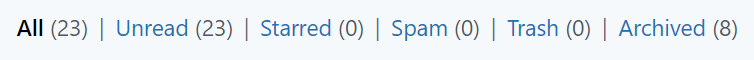
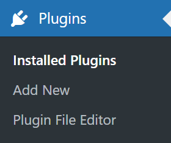
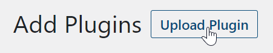
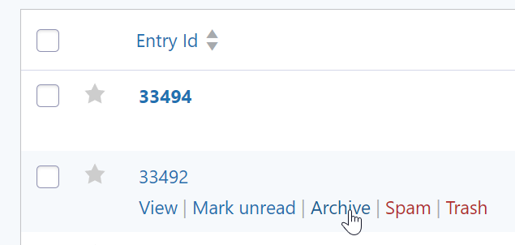

RS Entry Archives for Gravity Forms  (WordPress Plugin)
==

_This plugin adds the ability to archive Gravity Forms entries, which are hidden from the default entry view._

## Getting Started ##

### 1. Download the plugin: [rs-gf-entry-archives.zip](https://github.com/RadGH/rs-gf-entry-archives/archive/refs/heads/master.zip)
### 2. Upload to the Plugins screen.
### 3. Activate the plugin.

## Description ##

This plugin allows you to mark entries as archived, similar to how you would mark them as read or unread. Archived entries only show under the Entries list when you select the "Archived" filter.

Here you can see the archive functionality from the Entry list screen:

1. 
2. 
3. 

## Manual Install ##

1. Install and activate [Gravity Forms](https://www.gravityforms.com/) (not included).
2. Install this plugin's zip file through the Plugins screen:
   1. Navigate to the Plugins screen: 
   2. Click the button Upload Plugin: 
   3. Select the zip file, then click Install Now: 
3. Activate the plugin through the Plugins screen: 
4. View the entries for any form. Hover over an entry and see the "Archive" and "Unarchive" option.
5. You can view archived entries by selecting the "Archived" filter at the top, near the search field.

## Screenshots ##

On the entry list screen, a filter for "Archived" will appear allowing you to view the archived entries.

On the entry list, an "Archive" or "Unarchive" link will appear next to the "Spam" or "Trash" links.

When exporting entries, you can use conditional logic to get only archived or unarchived entries, or both.

A message appears to indicate when an entry has been archived.

## Changelog ##

#### 1.2.0
* Added to GitHub

#### 1.1.0
* First release
