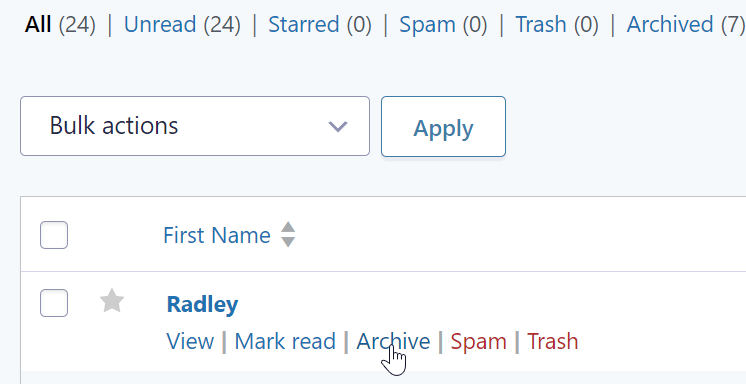
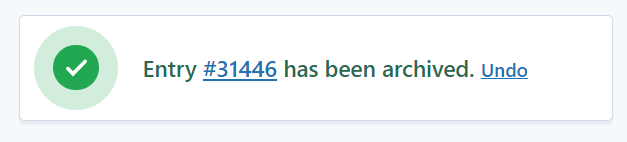
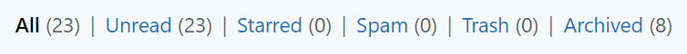
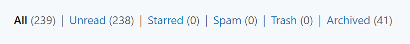
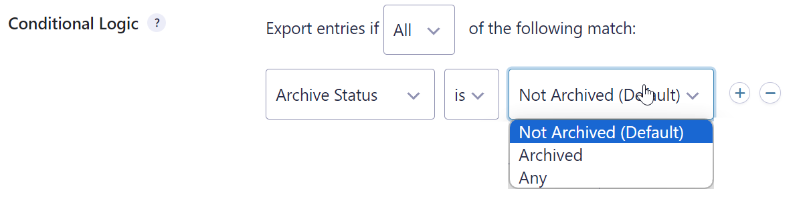

RS Entry Archives for Gravity Forms  (WordPress Plugin)
==

_This plugin adds the ability to archive Gravity Forms entries, which are hidden from the default entry view._

## Description ##

This plugin allows you to mark entries as archived, similar to how you would mark them as read or unread. Archived entries only show under the Entries list when you select the "Archived" filter.

Here you can see the archive functionality from the Entry list screen:

1. 
2. 
3. 

## Screenshots ##

On the entry list screen, a filter for "Archived" will appear allowing you to view the archived entries.

On the entry list, an "Archive" or "Unarchive" link will appear next to the "Spam" or "Trash" links.

When exporting entries, you can use conditional logic to get only archived or unarchived entries, or both.

A message appears to indicate when an entry has been archived.

## Changelog ##

#### 1.4.3
* Added the filter `rs_entry_archives/show_archived_entries`, if set to true, the entries displayed on the current page will show archived entries instead of active ones.

#### 1.4.2
* Moved separator before archive link

#### 1.4.1
* Added Git Updater support
* Updated Readme

#### 1.2.0
* Added to GitHub

#### 1.1.0
* First release
